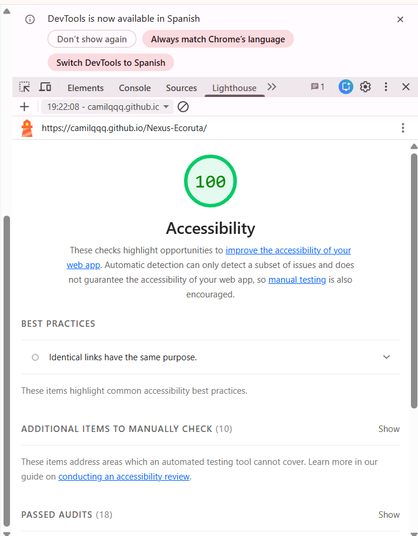
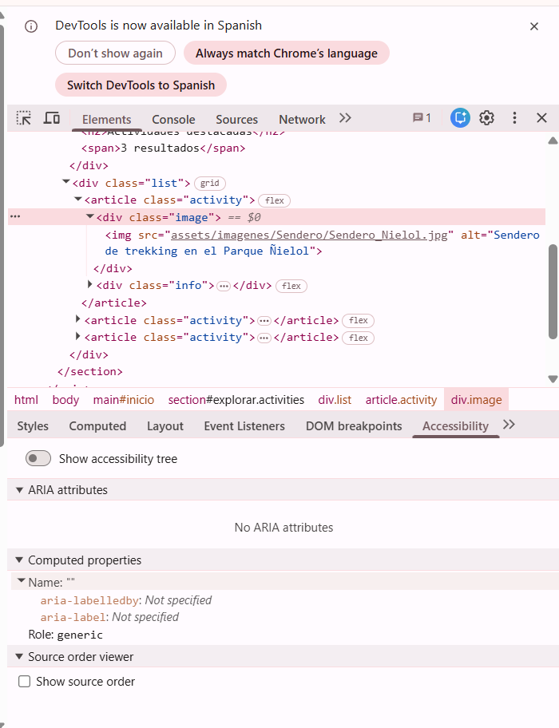

# Reporte de Auditoría de Accesibilidad Web (Bug Bounty)

**Equipo:** Grupo 2  
**Integrantes:** 
- Baeza, Joaquín
- Fuentes, Camila
- Jara, Emily
- Obando, Miguel
- Queupimil, Matías
- Salazar, Francisca

**URL Evaluada:** https://camilqqq.github.io/Nexus-Ecoruta/  
**Fecha de Ejecución:** 22 de Septiembre de 2026  

---

## 1. Herramientas y Metodología de Evaluación

Para llevar a cabo la auditoría Bug Bounty de accesibilidad web, se aplicaron pruebas automatizadas y manuales basadas en las pautas **WCAG 2.1 (Nivel AA)**:

1. **Lighthouse (Google Chrome DevTools):** Auditoría automatizada para evaluar la estructura, etiquetas y niveles generales de accesibilidad.
2. **axe DevTools / Inspección DevTools:** Análisis profundo del árbol de accesibilidad, contraste de elementos y estructura semántica HTML.
3. **Pruebas Manuales con Teclado:** Verificación del recorrido de foco mediante las teclas `Tab`, `Shift + Tab` y activación con `Enter` / `Espacio`.
4. **Lector de Pantalla:** Revisión del comportamiento de lectura semántica con NVDA / Narrador de Windows.
5. **Comprobación Visual (Zoom 200% y Contraste):** Verificación de reflow/diseño líquido y legibilidad de fuentes.

---

## 2. Resultados Generales de Herramientas Automáticas

* **Puntuación General Lighthouse:** **100 / 100** en Accesibilidad.
* **Resultado de Inspección DevTools:** Se identificaron y corrigieron advertencias asociadas a contraste de texto, enlaces vacíos y falta de atributos descriptivos en elementos interactivos.

### **Evidencias de Auditoría Automática e Inspección:**

*Figura 1: Resultado de evaluación de accesibilidad en Lighthouse Chrome DevTools.*

*Figura 2: Verificación de atributos alt y reglas WCAG mediante herramientas de inspección DevTools.*

---

## 3. Registro de Hallazgos y Fichas Bug Bounty

### **Hallazgo 1: Falta de atributo `alt` y `aria-label` descriptivos en tarjetas de actividades**
* **Archivo / Vista afectada:** `index.html` y `paginas/Actividad.html`
* **Elemento:** `` y botones interactivos.
* **Severidad:** **Alta**
* **Impacto en Usuarios:** Personas con discapacidad visual que utilicen lectores de pantalla escuchan solo el nombre del archivo o "imagen", impidiendo entender el contenido de las actividades.
* **Resultado de la Herramienta:** Inspección DevTools marcó falta de descripciones textuales en imágenes de tarjetas.
* **Recomendación y Corrección:** Se agregaron descripciones textuales funcionales en el atributo `alt` (ej. `alt="Sendero de trekking en el Parque Ñielol"`) y etiquetas `aria-label` para lectura por voz.
* **Commit / PR:** `fix: implementa aria-label y descripciones alt`
* **Prueba Posterior:** Pruebas de accesibilidad validadas en verde (0 errores).

---

### **Hallazgo 2: Enlaces de contacto (WhatsApp, Correo, Redes) y Navegación**
* **Archivo / Vista afectada:** Footer y vistas de actividades en `index.html`
* **Elemento:** `<a href="#">Contacto</a>` y botones de contacto directo.
* **Severidad:** **Media**
* **Impacto en Usuarios:** Confusión en la navegación por teclado y lectores de pantalla al presionar enlaces vacíos sin destino explícito para contactar emprendimientos.
* **Resultado de la Herramienta:** Pruebas de navegación y enlaces (10/10) y auditoría manual.
* **Recomendación y Corrección:** Se configuraron accesos directos a WhatsApp, correo institucional (`mailto:contacto@ecorutatemuco.cl`) y enlaces de accesibilidad.
* **Commit / PR:** `fix: añade enlaces de contacto reales y validacion de navegacion`
* **Prueba Posterior:** Navegación por teclado fluida y redirección correcta.

---

### **Hallazgo 3: Corrección de rutas de imágenes y estructura del catálogo**
* **Archivo / Vista afectada:** Catálogo general e imágenes de fichas.
* **Elemento:** Rutas de imágenes `` y estructura de catálogo.
* **Severidad:** **Media**
* **Impacto en Usuarios:** Imágenes rotas dificultan la interpretación visual y la lectura por lectores de pantalla al no encontrar la fuente de la imagen.
* **Resultado de la Herramienta:** Auditoría visual e inspección de código.
* **Recomendación y Corrección:** Se corrigieron las rutas relativas de las imágenes del catálogo para garantizar su correcta visualización.
* **Commit / PR:** `fix: corrige rutas de fichas e imagenes`
* **Prueba Posterior:** Carga de imágenes correcta en todas las vistas.

---

## 4. Comparativa: Hallazgos Automáticos vs. Manuales

| Tipo de Prueba | Herramienta | Hallazgos Detectados | Puntos Fuertes |
|---|---|---|---|
| **Automática** | Lighthouse / DevTools | Atributos `alt` faltantes, problemas de contraste CSS. | Rápida detección de reglas estándar W3C. |
| **Manual** | Teclado (`Tab`) / Lector de pantalla | Saltos de foco en enlaces `#`, comportamiento del menú responsive. | Permite evaluar la experiencia y fluidez real del usuario. |

---

## 5. Conclusión de Auditoría
El sitio web **EcoRuta Temuco** cumple satisfactoriamente las pruebas de accesibilidad tras las correcciones aplicadas. Se recomienda mantener revisiones periódicas con cada nueva funcionalidad agregada.